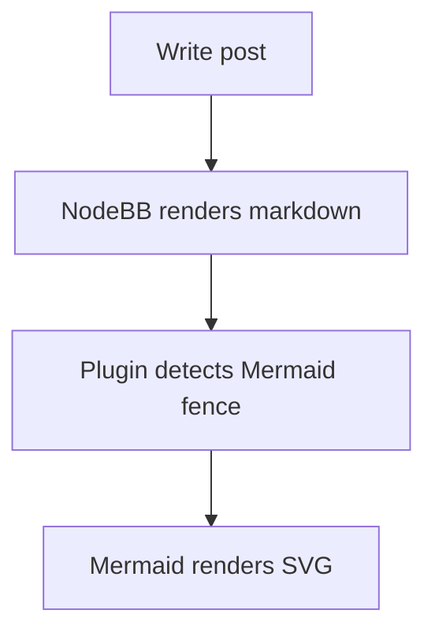

# NodeBB Plugin Mermaid

Lazy Mermaid diagram rendering for NodeBB 3.10+ posts.

## What It Does

This plugin detects Mermaid code fences in rendered post content and turns them into diagrams in the browser:

````markdown

````

The Mermaid browser runtime is loaded only when a diagram is present. The runtime is served from the installed `mermaid` npm package through NodeBB's plugin static directory, so the forum does not depend on a third-party CDN at render time.

## Compatibility

- NodeBB: `^3.10.0`
- Mermaid: `^11.14.0`

## Installation For Development

```bash
cd nodebb-plugin-mermaid
npm install
npm link

cd /path/to/nodebb
npm link nodebb-plugin-mermaid
./nodebb activate nodebb-plugin-mermaid
./nodebb build
./nodebb restart
```

## Verification

```bash
npm test
npm run lint
npm audit
```

## Implementation Notes

- Scans `#content` after initial page load and `action:ajaxify.end`.
- Converts `pre > code.language-mermaid` and `pre > code.lang-mermaid` blocks into Mermaid render nodes.
- Keeps Mermaid `securityLevel` at `strict`.
- Avoids duplicate rendering with `data-nodebb-mermaid-state`.
- Honors NodeBB's `config.relative_path` when loading the local Mermaid asset.
